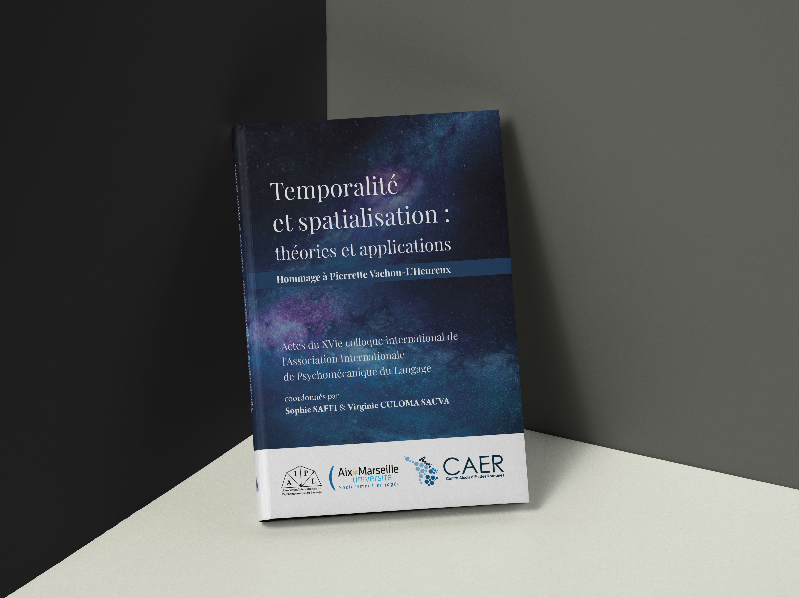

> Chères et Chers membres de l'AIPL,
> 
>
> 
> J'ai le plaisir de vous annoncer la parution des Actes du XVIe colloque
> international de l'AIPL Temporalité et spatialisation : théories et applications
> que vous pouvez consulter en cliquant sur l'onglet Actes.
>
> 
> 
> Le XVIe colloque international de l’AIPL a donné lieu à de fructueux
> échanges sur la conception et l’expression linguistique de la temporalité
> qui sont présentés dans cet ouvrage. La première partie est consacrée aux
> théories linguistiques de la représentation du temps, la deuxième partie à la
> chronogenèse guillaumienne appliquée à différents systèmes de langue (allemand,
> anglais, arabe, espagnol, français, italien, pāli, russe). Les Varia accueillent
> les articles des doctorants ayant présenté un poster.
> 
> Nous rendons hommage avec cette publication à Pierrette Vachon-L’Heureux,
> secrétaire Amérique de l’AIPL, dont la communauté psychomécanique regrette la
> disparition.
> 
> 
> Bien cordialement, Sophie SAFFI, Présidente de l'AIPL.

## NOUVELLE PUBLICATION GUILLAUMIENNE

[Vjekoslav Cosic, LA (PSYCHO)SYSTÉMATIQUE DE GUSTAVE GUILLAUME](https://www.editions-harmattan.fr/livre-la_psycho_systematique_de_gustave_guillaume_vjekoslav_cosic-9782343239231-71373.html)

Quelques extraits dont le sommaire [ici](http://liseuse.harmattan.fr/978-2-343-23923-1).

## BIENVENUE SUR LE SITE-BLOGUE DE L'AIPL!

Vous vous trouvez sur le site-blogue de l'Association Internationale de Psychomécanique du Langage (AIPL).

La psychomécanique du langage a été découverte par le linguiste français Gustave Guillaume (1883-1960) à une époque où l'on ne parlait pas encore de "constructivisme" dans les sciences humaines. Aussi peut-on dire que la psychomécanique constitue un *constructivisme avant la lettre*.

Ce qui permet d'affirmer cela, c'est que Guillaume "reconstruit" consciemment, pour en faire un objet de curiosité scientifique, ce qui a été "construit" inconsciemment, pendant des siècles et des millénaires, par les communautés de sujets parlants : le langage humain.

Aujourd'hui, toute une branche de la linguistique moderne se réfère à la psychomécanique.

Au travers de ce site-blogue, l'AIPL se propose de donner, à toutes celles et à tous ceux qui s'intéressent à la pensée de Guillaume et aux recherches en psychomécanique, un lieu où ils pourront échanger.
